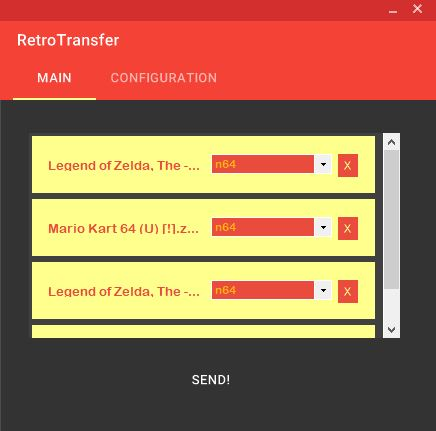
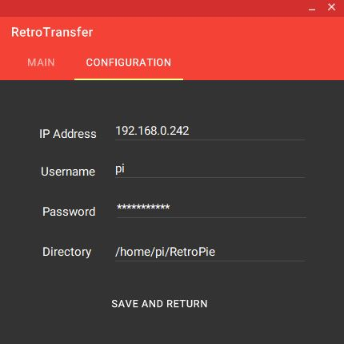

# RetroTransfer



## **What is RetroTransfer?**
---
RetroTransfer is a utility for Windows that helps transfer ROM files from a user's computer to their Raspberry Pi's RetroPie installation directory. This process is carried out via SCP connection.

*Note: I do not condone piracy. Please ensure that you legally own the games that you are transferring using this utility.* 

## **What do I need to use RetroTransfer?**
---
* A Raspberry Pi connected to the same network as your machine from which you will be running RetroTransfer;
* An installation of RetroPie on the Raspberry Pi; and
* SSH must be enabled on the Raspberry Pi ([please see here for more details on how to do this](https://retropie.org.uk/docs/SSH/)). 


## **How do I use RetroTransfer?**
---

### **I have just booted up the application. How do I configure the application so that it can send files to my Raspberry Pi?**



When you use RetroTransfer for the first time, you will automatically be brought to the "Configuration" screen. The following details are required:

* **IP Address**: This is the IP address of your Raspberry Pi. If you don't know what the IP address, you can find this using the ifconfig command.
* **Username**: This is your username for your Raspberry Pi that was set when the Raspberry Pi was being setup. 
* **Password**: This is the password for your Raspberry Pi that was set when the Raspberry Pi was being setup. 
* **Directory**: This is the directory on your Raspberry Pi where RetroPie is installed. It defaults to /home/{username}/RetroPie usually, but in the event you have installed it somewhere else, please feel free to modify accordingly, ensuring that the format remains the same (i.e. starts with forward slash, but no forward slash after "RetroPie"). 

When you click "Save and Return", the details will be saved down to a file called "config.txt" in the root directory of the application, so that your settings can be loaded automatically whenever you start up the application the next time. The password is encrypted before it is saved down, so please do not try to modify this file directly. 

You can delete all settings related to your Raspberry Pi simply by deleting the "config.txt" file.

### **I have already saved down details of my Raspberry Pi, but now I want to change things. How do I do this?**

To change any detials relating to your Raspberry Pi, navigate back to the configuration tab, update the details, and press "Save and Return". The new details will be saved down to the configuration file once the program exits.

### **OK, the configuration is complete. How do I start adding ROMs that I want to send?**

Simply drag and drop any ROM files you wish to send to the panel on the main screen, and they will be added to the queue of items that will be sent when you press the "Send" button. You can drag and drop as many times as you like, whether you want to add the files piece-meal or in groups. 

RetroTransfer will read the extension of the files and will try to determine which platform the ROM belongs to. This will determine which sub-folder in your RetroPie directory the ROM will be sent to. 

### **Hey, wait a minute - the application didn't recognise my file extension, and now the dropdown where the platform is supposed to be is blank! What gives?**

I designed this application largely with personal use in mind, so I mostly included support for extensions for platforms that I play the most. 

However, if the appliation did not pick up on the file extension, you can still choose the appropriate platform from the dropdown list and RetroTransfer will send the file to the sub-directory associated with that platform. 

### **I play loads of games for the Atari 2600 / Vectrex / other consoles that are not as well known, and I don't want to have to constantly change the dropdown when RetroTransfer doesn't recognise my ROM extensions. Is there any solution for this?**

Yes! Platforms and their file extensions are read in from a file called "platforms.txt" in the root directory, so it is entirely possible to add new extensions and platforms that RetroTransfer will then be able to recognise. 

In order to do this, open "platforms.txt" and add a new line in the following format:

```platformsubfoldername:.extension1,.extension2```

So for example, if I wanted to add support for the N64, which has file extensions .z64, .n64 and .v64, then I would include the following line into "platforms.txt":

```n64:.z64,.n64,.v64```

Using the same logic you can edit existing file extensions in the list, too. If you would like to add a platform to the list but don't want to associate it to any file extensions, you can do so by choosing ".dummy" as the sole extension.

Please note that the file extensions must be unique to all other file extensions in the list - so for example, having two platforms that have ".iso" as an extension is not supported. Such files can still be transferred to the Raspberry Pi, however, by selecting the appropriate platform from the dropdown list. 

### **OK, all my ROMs are loaded up. How do I send these to my Raspberry Pi?**

All you need to do now is press "Send" :) 

One point to note, however, is that RetroPie doesn't seem to refresh the list of ROMs immediately once a transfer has taken place, so you may need to restart RetroPie for your new ROMs to appear.


### **How technologies does RetroTransfer use?**
---

RetroTransfer was built with C# using the WinForms and MaterialSkin libraries for the UI, and the SSH.NET library for carrying out the SCP connection.

**END**